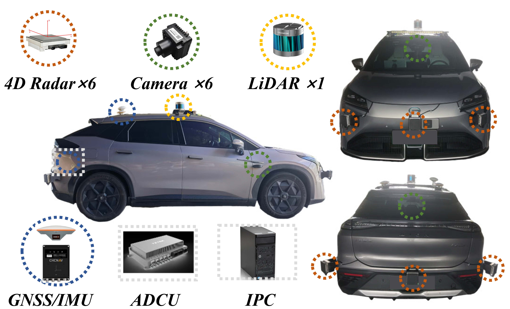

<div align="center">

# OmniHD-Scenes: A Next-Generation Multimodal Dataset for Autonomous Driving

<sup>1, \*</sup>[Lianqing Zheng](https://zhenglianqing.github.io/), <sup>1, \*</sup>[Long Yang](https://lucasyang567.github.io/), <sup>2, \*</sup>[Qunshu Lin](https://linqunshu.com), <sup>1</sup>Wenjin Ai, <sup>3</sup>[Minghao Liu](https://huggingface.co/Liam-Liu), <sup>1</sup>Shouyi Lu, <sup>4</sup>Jianan Liu, <br><sup>1</sup>Hongze Ren, <sup>1</sup>Jingyue Mo, <sup>2</sup>[Xiaokai Bai](https://shawnnnkb.github.io/),<sup>5</sup>Jie Bai,<sup>1, †</sup>Zhixing Ma,<sup>1,#</sup>Xichan Zhu

<sup>1</sup>Tongji University, <sup>2</sup>Zhejiang University, <sup>3</sup>2077AI  
<sup>4</sup>Momoni AI
<sup>5</sup>Hangzhou City University

</div>

<p align="center">
  <a href="https://arxiv.org/abs/2412.10734" target='_blank'>
    
  </a>
  <a href="https://arxiv.org/abs/2412.10734" target='_blank'>
    
  </a> 
  <a href="https://www.2077ai.com/OmniHD-Scenes" target='_blank'>
    
  </a>
  <a href="https://github.com/TJRadarLab/OmniHD-Scenes" target='_blank'>
    
  </a>
  <a href="https://github.com/tatsu-lab/stanford_alpaca/blob/main/LICENSE" target='_blank'>
  
  </a>
</p>

## 🔥 News
•	**[2025-07-28]** 🚀 Our codebase and detection models have been released.

•	**[2025-04-15]** 🎉 Our OmniHD-Scenes dataset v1.0 (~1.3TB) is openly [accessible](https://www.2077ai.com/contact) for research purposes.

•	**[2024-12-31]** 🌐 The [project page](https://www.2077ai.com/OmniHD-Scenes) is now online.


##  🛠️ Abstract
 We present OmniHD-Scenes, a large-scale multimodal dataset that provides comprehensive omnidirectional high-definition data. The OmniHD-Scenes dataset combines data from 128-beam LiDAR, six cameras, and six 4D imaging radar systems to achieve full environmental perception. To date, we have annotated 200 clips with more than 514K precise 3D bounding boxes. These clips also include semantic segmentation annotations for static scene elements. Alongside the proposed dataset, we establish comprehensive evaluation metrics, baseline models, and benchmarks for 3D detection and semantic occupancy prediction. 
<div style="display: flex; justify-content: center; width: 100%; gap: 10px;">
  
  
</div>
<div align="center">
  <b>Data Acquisition Platform and Coordinate System</b>
</div>


## ⚙️ Dataset Structure
OmniHD-Scenes is structured in clips, drawing inspiration from nuScenes' data composition format. The dataset is organized as follows.
```shell
OmniHD-Scenes
├── 1693714828633418               # Clip Scene
│   ├── cameras                    # Six Cameras
│   │   ├── camera_back                
│   │   │   ├── xxxxxxxxx.jpg         
│   │   │   └── ... 
│   │   ├── camera_front                
│   │   │   ├── xxxxxxxxx.jpg          
│   │   │   └── ... 
│   │   ├──...
│   │   ├── camera_right_front
│   │   │   ├── xxxxxxxxx.jpg          
│   │   │   └── ...                
│   ├── lidar                    # LiDAR
│   │   ├── lidar_top_compensation             
│   │   │   ├── xxxxxxxxx.bin          
│   │   │   └── ... 
│   ├── radars                    # Six 4D Radars
│   │   ├── radar_back                
│   │   │   ├── xxxxxxxxx.bin         
│   │   │   └── ... 
│   │   ├── radar_front                
│   │   │   ├── xxxxxxxxx.bin          
│   │   │   └── ... 
│   │   ├──...
│   │   ├── radar_right_front
│   │   │   ├── xxxxxxxxx.bin          
│   │   │   └── ...
├──...
├── 1693922406733409               
├── v1.0-trainval
│   ├── annotations.json           # 3D box label
│   ├── ego_pose.json                # ego pose
│   ├── imu.json                   # ego status
│   ├── meta.json                   # scene description
│   ├── sample_data.json           # index of all frames
│   ├── sample.json                # key frames
│   ├── scene_split.json           # train/test split
│   └── sensor_calibration.json    # calib parameters
```


<div align="center">
  
</div>
<div align="center">
  <b> Multiple scenes and 3D annotation visualization
  System</b>
</div>

<div align="center">
  
</div>
<div align="center">
  <b> Multiple scenes and semantic occupancy visualization</b>
</div>


## 🔨 Quick Start
### Installation
You can install the whole repository by following these steps:

Clone
```
git clone https://github.com/TJRadarLab/OmniHD-Scenes.git
```
Create environment 
```
conda create -n omnihd python=3.8 -y
conda activate omnihd
```
Install pytorch
```
pip install torch==1.9.1+cu111 torchvision==0.10.1+cu111 torchaudio==0.9.1 -f https://download.pytorch.org/whl/torch_stable.html
```
Install mmcv/mmdet/mmseg
```
pip install mmcv-full==1.4.0 -f https://download.openmmlab.com/mmcv/dist/cu111/torch1.9.0/index.html
pip install mmdet==2.14.0
pip install mmsegmentation==0.14.1
```
Install mmdet3d
```
git clone https://github.com/open-mmlab/mmdetection3d.git
cd mmdetection3d
git checkout v0.17.1 
pip install -v -e .  
```

Install others
```
pip install scikit-image==0.19.3  
pip install einops fvcore seaborn iopath==0.1.9 timm==0.6.13  typing-extensions==4.5.0 pylint ipython==8.12  numpy==1.19.5 matplotlib==3.5.2 numba==0.48.0 pandas==1.4.4 scikit-image==0.19.3 setuptools==59.5.0 torch_scatter==2.1.1
python -m pip install 'git+https://github.com/facebookresearch/detectron2.git'
pip install yapf==0.40.1
python projects/setup.py develop
python projects/setup_bevpool2.py develop
```
### Generate PKL

Generate PKL file for only 3D object detection training and testing
```
python ./newscenes_devkit/newscenes_converter_final.py
```
Generate PKL file for Occupancy&OD  training and testing
```
python ./tools/merge_data_with_occ.py
```
Or you can download our generated [pkl_files](https://pan.baidu.com/s/1QLTnUnJ5nmZARD0McysaEw?pwd=TJ4D).
### Test

Test a baseline model
```
./tools/dist_test.sh ./projects/configs/XXX/XXX.py ./work_dirs/XXX/XXX.pth 2
```

## 🍁 Baseline Results


## 🚀 Model Zoo

In this repository, we release baseline models for 3D object detection.

|      Methods       |       Modality       |Image Size  | Backbone | mAP | ODS |      Models                         |
| :--------------------------------------------------------: | :------: | :------: | :------: | :--------: | :-------: | :----------------------------------------------------------: |
| [PointPillars](projects/configs/PointPillars_NewScenes/pointpillars_LiDAR.py) | LiDAR |   ---    |   ---    |   61.15   |   55.54   | [Link](https://pan.baidu.com/s/1pihyepSM_IqyxPttQC8dNg?pwd=TJ4D) |
| [PointPillars](projects/configs/PointPillars_NewScenes/pointpillars_4DRadar.py) | 4D Radar |   ---    |   ---    |   23.82   |   37.21   | [Link](https://pan.baidu.com/s/1VNgnPjxavunxbK4_FjkQGg?pwd=TJ4D) |
| [RadarPillarNet](projects/configs/RCFusion_NewScenes/radar_stream/RadarPillarNet.py) | 4D Radar |   ---    |   ---    |   24.88   |   37.81   | [Link](https://pan.baidu.com/s/12DjKyFX-36e8feg54ZGY-w?pwd=TJ4D) |
| [LSS](projects/configs/bevfusion_NewScenes/cam_stream/LSS.py) | Camera |   544×960    |   R50    |   22.44   |   26.01   | [Link](https://pan.baidu.com/s/1zpazgF6JNSi93QznVCq4Lw?pwd=TJ4D) |
| [BEVFormer-T](projects/configs/bevformer_NewScenes/bevformer_T_R50.py) | Camera |   544×960    |   R50    |   29.17   |   30.54   | [Link](https://pan.baidu.com/s/1NSKhRaC6Ioo1mVDuT3K4Iw?pwd=TJ4D) |
| [BEVFormer-T](projects/configs/bevformer_NewScenes/bevformer_T_R101.py) | Camera |   864×1536    |   R101-DCN    |   32.22   |   32.57   | [Link](https://pan.baidu.com/s/1IhchCkgGndlW8o6TDsQ_Hw?pwd=TJ4D) |
| [BEVFusion](projects/configs/bevfusion_NewScenes/bevfusion.py) | Camera+4D Radar |   544×960    |   R50    |   33.95  |   43.00   | [Link](https://pan.baidu.com/s/1oYBsA3lQ-S4UhfcN8SpL-Q?pwd=TJ4D) |
| [RCFusion](projects/configs/RCFusion_NewScenes/rcfusion_lss.py) | Camera+4D Radar |   544×960    |   R50    |   34.88  |   41.53   | [Link](https://pan.baidu.com/s/1kp7-RXjiLTxklEAXt646IA?pwd=TJ4D) |
## ⏳ To Do
- [x] Release the CodeBase 
- [x] Release the Evaluation Devkit (For historical reasons, it is referred to by its original project name newscenes_devkit within the code)
- [x] Release OD baseline models
- [ ] Release the OCC label
- [ ] [Release OCC baseline models](https://github.com/LucasYang567/MetaOcc)


## ⭐ Others
If you have any questions about the dataset, feel free to cantact us with tjradarlab@163.com & contact@2077ai.com.

## 🎬 Video Demo
[](https://github.com/user-attachments/assets/638eeead-2800-4a42-802a-d7f5e8149992)

[](https://github.com/user-attachments/assets/f5822cbc-4dca-42d0-a06b-f7faf02a08dc)

[](https://github.com/user-attachments/assets/d683a67a-63e1-4013-9f53-08df7f28a4b3)
## 😙 Acknowledgement

Many thanks to these exceptional open source projects:
- [BEVFormer](https://github.com/fundamentalvision/BEVFormer)
- [mmdet3d](https://github.com/open-mmlab/mmdetection3d)
- [nuScenes-devkit](https://github.com/nutonomy/nuscenes-devkit)
- [SurroundOcc](https://github.com/weiyithu/SurroundOcc)
- [BEVFusion](https://github.com/ADLab-AutoDrive/BEVFusion)

As it is not possible to list all the projects of the reference papers. If you find we leave out your repo, please contact us and we'll update the lists.

## 📃Citation

```
@article{zheng2024omnihd,
  title={OmniHD-Scenes: A next-generation multimodal dataset for autonomous driving},
  author={Zheng, Lianqing and Yang, Long and Lin, Qunshu and Ai, Wenjin and Liu, Minghao and Lu, Shouyi and Liu, Jianan and Ren, Hongze and Mo, Jingyue and Bai, Xiaokai and others},
  journal={arXiv preprint arXiv:2412.10734},
  year={2024}
}
```
